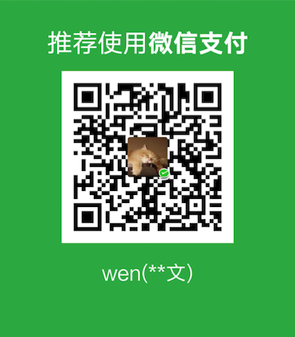

# DingTalk Golang SDK

DingTalk Golang SDK https://github.com/icepy

# Feature Overview

- 支持ISV，企业，SSO，SNS（H5 Web App）免登
- 支持个人小程序免登
- 支持对access_token自动续期过期管理（已使用独占锁，请勿再加锁）
- 支持注册钉钉事件回调
- 支持对钉钉事件回调消息签名的加解密
- 支持全部 Open api
- 支持全部 Top api，并且自动处理生成加密签名

# Test

- Test get auth scopes
- Test get company acess_token
- Test get company ticket
- Test upload file
- Test download file

```bash
~ ᐅ cd __test__
~ ᐅ go test
```

# Install

```bash
~ ᐅ go get -u github.com/icepy/go-dingtalk
~ ᐅ go-dingtalk
Current SDK VERSION=0.1
Current SDK OAPIURL=https://oapi.dingtalk.com/
Current SDK TOPAPIURL=https://eco.taobao.com/router/rest
~ ᐅ
```

# Guide

```bash
~ ᐅ npm i -g vuepress
~ ᐅ cd docs
~ ᐅ vuepress dev
```

# Help

**Example**

```go
package main

import (
  "os"
  "github.com/icepy/go-dingtalk/src"
)

func main() {
  c := getCompanyDingTalkClient()
  c.RefreshCompanyAccessToken()
}

func getCompanyDingTalkClient() *dingtalk.DingTalkClient {
  CorpID := os.Getenv("CorpId")
  CorpSecret := os.Getenv("CorpSecret")
  config := &dingtalk.DTConfig{
    CorpID:     CorpID,
    CorpSecret: CorpSecret,
  }
  c := dingtalk.NewDingTalkCompanyClient(config)
  return c
}

```

**ISV免登讲解**

- 首先调用RefreshSuiteAccessToken刷新suite_access_token
- 等待钉钉推送临时Code给你

```go
// 假设你在服务端部署了get_code服务
package main

import (
  "fmt"
  "log"
  "net/http"
)

func GetCode(w http.ResponseWriter, req *http.Request) {
  // 获取临时授权code
  // 并返回{success:true}
}

func main() {
  http.HandleFunc("/get_code", GetCode)
  err := http.ListenAndServe("localhost:8080", nil)
  if err != nil {
    log.Fatal("ListenAndServe: ", err.Error())
  }
}
```
- 调用IsvGetPermanentCode
- 调用IsvActivateSuite给企业激活套件
- 调用IsvGetCorpAccessToken获取企业的access_token

⚠️至此，你要注意

- 只有isv的suite_access_token是单例
- corp_access_token是不同的，企业a换取来的corp_access_token是1，企业b换取来的corp_access_token是2
- 建议：**isv可以用Redis，总之是这种key-value的存储来维护corp_access_token，企业的永久授权码是不会变的。在没过期之前，根据永久授权码从map里拿corp_access_token，如果过期了，又走一次流程，换取新的永久授权码，继续存入map，更新key-value系统。**

# Contribute

- For a small change, just send a PR.
- For bigger changes open an issue for discussion before sending a PR.
- PR should have:
  - Test case
  - Documentation
  - Example (If it makes sense)
- You can also contribute by:
  - Reporting issues
  - Suggesting new features or enhancements
  - Improve/fix documentation

# 打赏

<div align="left">
  
</div>

# License

MIT License

Copyright (c) 2018 

Permission is hereby granted, free of charge, to any person obtaining a copy
of this software and associated documentation files (the "Software"), to deal
in the Software without restriction, including without limitation the rights
to use, copy, modify, merge, publish, distribute, sublicense, and/or sell
copies of the Software, and to permit persons to whom the Software is
furnished to do so, subject to the following conditions:

The above copyright notice and this permission notice shall be included in all
copies or substantial portions of the Software.

THE SOFTWARE IS PROVIDED "AS IS", WITHOUT WARRANTY OF ANY KIND, EXPRESS OR
IMPLIED, INCLUDING BUT NOT LIMITED TO THE WARRANTIES OF MERCHANTABILITY,
FITNESS FOR A PARTICULAR PURPOSE AND NONINFRINGEMENT. IN NO EVENT SHALL THE
AUTHORS OR COPYRIGHT HOLDERS BE LIABLE FOR ANY CLAIM, DAMAGES OR OTHER
LIABILITY, WHETHER IN AN ACTION OF CONTRACT, TORT OR OTHERWISE, ARISING FROM,
OUT OF OR IN CONNECTION WITH THE SOFTWARE OR THE USE OR OTHER DEALINGS IN THE
SOFTWARE.
